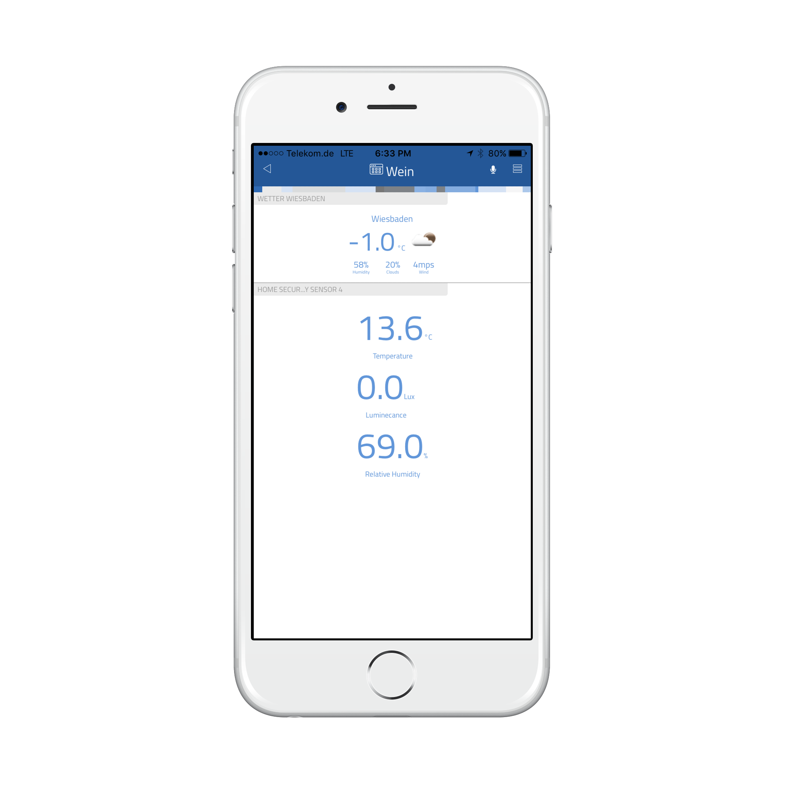

# thing-it-weather

Device Plugins for [[thing-it-node]](https://github.com/marcgille/thing-it-node) and [thing-it.com](wwww.thing-it.com) for weather via the (http://openweathermap.org) weather service.

## User Interface

This example shows the weather device UI together with the UI of a Z-Wave indoor sensor for temperature, humidity, 
and light in a wine cellar. It allows to see how outside weather influences the wine cellar currently.
 
 

## Usages

Dashboarding capabilities at [thing-it.com](wwww.thing-it.com) allow to generate charts that correlate outside weather
data with any other sensor or actor. With that combination a variety of interesting analytical questions can be answered: 
* What is the response of a room to the outside temperature? - As shown above.
* How electricity usage get influenced by weather? - With the weather device and an energy meter.
* How does my soil moisture correlate to outside circumstances? - 

You can also trigger action based on weather data:
* Send an alert to a user if the temperature is below freezing.
* Turn on the irrigation if it hasn't rained for more than 48h.
* Start a process to check the status of an outdoor device that was subject to very high heat.

## Configuration

Configure the following parameters via [thing-it] Mobile or [thing-it.com](wwww.thing-it.com).
* City Name: The name of the city the weather should be retrieved for. Examples are 'Sydney' and 'Frankfurt am Main'.
* Country Code: The country code (such as 'au' and 'de') for the country the city is in.
* Language Code: The language code (such as 'en', 'de') for the result.
* Units: Either 'metric' or 'imperial', default is 'metric'
* Update Frequency Seconds: Time in seconds until [thing-it] requests the next weather update. This should typically be
more than 10 minutes, so a value of 600 or higher.
* Open Weather Map Key: They key you get after registering at (http://openweathermap.org).

## Where to go from here ...

After completing the above, you may be interested in

* Connecting additional [Devices](https://www.thing-it.com/thing-it/#/documentationPanel/mobileClient/deviceConfiguration) and configuring
[Groups](https://www.thing-it.com/thing-it/#/documentationPanel/mobileClient/groupConfiguration), 
[Services](https://www.thing-it.com/thing-it/#/documentationPanel/mobileClient/serviceConfiguration), 
[Event Processing](https://www.thing-it.com/thing-it/#/documentationPanel/mobileClient/eventConfiguration), 
[Storyboards](https://www.thing-it.com/thing-it/#/documentationPanel/mobileClient/storyboardConfiguration) and 
[Jobs](https://www.thing-it.com/thing-it/#/documentationPanel/mobileClient/jobConfiguration) via your **[thing-it] Mobile App**.
* Use [thing-it.com](https://www.thing-it.com) to safely connect your Node Box from everywhere, manage complex configurations, store and analyze historical data 
and offer your configurations to others on the **[thing-it] Mesh Market**.
* Explore other Device Plugins like [Texas Instruments Sensor Tag](https://www.npmjs.com/package/thing-it-device-ti-sensortag), [Philips Hue Lighting](https://www.npmjs.com/package/thing-it-device-philips-hue) and many more. For a full set of 
Device Plugins search for **thing-it-device** on [npm](https://www.npmjs.com/). Or [write your own Plugins](https://github.com/marcgille/thing-it-node/wiki/Plugin-Development-Concepts).